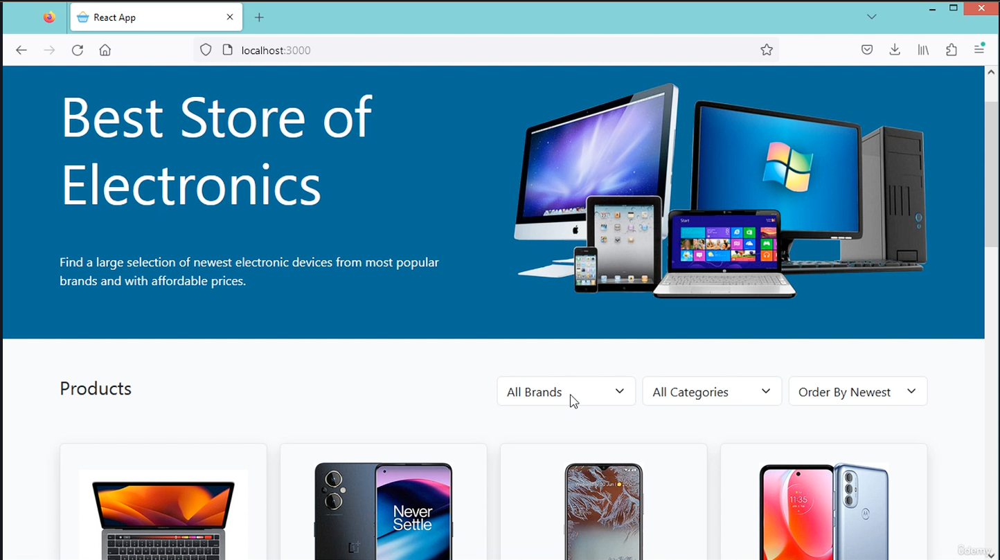

## 🛒 E-Commerce React App (Personal Project)

This is a personal project I created to dive deep into **React.js** and modern front-end development.  
The goal? Build a complete **e-commerce front-end application** using React and simulate real-world features like routing, authentication, data handling, and more.

The app is built as a **Single Page Application (SPA)**, where one HTML file handles all views dynamically through React components. For the backend, I used **JSON Server** to simulate a REST API, so I could focus purely on front-end functionality.

Throughout this project, I implemented features like **product management**, **user authentication**, **form validation**, and **image upload** — all essential elements of a full-featured app.

---

## ⚙️ Main Features

- 🔹 Create, Read, Update, and Delete (CRUD) products using **Fetch API**
- 🔹 Use **React Router** to manage routes and protect private views
- 🔹 Handle **user registration**, **login**, and **role-based authorization** with **JWT**
- 🔹 Build reusable **React components** using **JavaScript**, **JSX**, and **Bootstrap**
- 🔹 Implement **React Hooks**: `useState`, `useEffect`, and `useContext`
- 🔹 Manage state across components and use **local storage** for persistence
- 🔹 Build **controlled and uncontrolled forms** with client/server validation
- 🔹 Add **pagination**, **search**, **filter**, and **sorting**
- 🔹 Upload and display **product images**
- 🔹 Apply styling using **Bootstrap CSS**, JS, and icons via CDN

---

## 🛠️ Tech Stack

- **React.js**
- **JavaScript / JSX**
- **Bootstrap 5**
- **JSON Server (mock backend)**
- **Fetch API**
- **JWT (JSON Web Tokens)**
- **React Router DOM**

---

## 🔑 Why I Built This

I created this project to solidify my knowledge in front-end development using React.  
My goal was to simulate what a real-world e-commerce platform might need, from a user-friendly interface to backend communication and data handling.

This project helped me explore advanced React patterns, improve my code structure, and better understand how frontend and backend work together.

---

## 📦 Future Improvements

- Integrate with a real backend (e.g., Node.js or Firebase)
- Add cart and checkout functionality
- Improve responsive design
- Unit testing with Jest or React Testing Library

---

## 📸 Screenshot

---

## 🙌 Acknowledgments

Inspired by learning resources and real-world app requirements — built with ❤️ and lots of curiosity.
